# White Wine Quality Exploration 
### Christopher Giler
### September 25, 2016

========================================================


This report explores a dataset which quantifies the chemical properties and quality ratings of 4,898 white wines. The goal of this exploratory data analysis is to determine which of these properties has the most influence on white wine quality.

# Univariate Plots Section

### Data Properties

```
## [1] 4898   13
```

```
## 'data.frame':	4898 obs. of  13 variables:
##  $ X                   : int  1 2 3 4 5 6 7 8 9 10 ...
##  $ fixed.acidity       : num  7 6.3 8.1 7.2 7.2 8.1 6.2 7 6.3 8.1 ...
##  $ volatile.acidity    : num  0.27 0.3 0.28 0.23 0.23 0.28 0.32 0.27 0.3 0.22 ...
##  $ citric.acid         : num  0.36 0.34 0.4 0.32 0.32 0.4 0.16 0.36 0.34 0.43 ...
##  $ residual.sugar      : num  20.7 1.6 6.9 8.5 8.5 6.9 7 20.7 1.6 1.5 ...
##  $ chlorides           : num  0.045 0.049 0.05 0.058 0.058 0.05 0.045 0.045 0.049 0.044 ...
##  $ free.sulfur.dioxide : num  45 14 30 47 47 30 30 45 14 28 ...
##  $ total.sulfur.dioxide: num  170 132 97 186 186 97 136 170 132 129 ...
##  $ density             : num  1.001 0.994 0.995 0.996 0.996 ...
##  $ pH                  : num  3 3.3 3.26 3.19 3.19 3.26 3.18 3 3.3 3.22 ...
##  $ sulphates           : num  0.45 0.49 0.44 0.4 0.4 0.44 0.47 0.45 0.49 0.45 ...
##  $ alcohol             : num  8.8 9.5 10.1 9.9 9.9 10.1 9.6 8.8 9.5 11 ...
##  $ quality             : int  6 6 6 6 6 6 6 6 6 6 ...
```

```
##        X        fixed.acidity    volatile.acidity  citric.acid    
##  Min.   :   1   Min.   : 3.800   Min.   :0.0800   Min.   :0.0000  
##  1st Qu.:1225   1st Qu.: 6.300   1st Qu.:0.2100   1st Qu.:0.2700  
##  Median :2450   Median : 6.800   Median :0.2600   Median :0.3200  
##  Mean   :2450   Mean   : 6.855   Mean   :0.2782   Mean   :0.3342  
##  3rd Qu.:3674   3rd Qu.: 7.300   3rd Qu.:0.3200   3rd Qu.:0.3900  
##  Max.   :4898   Max.   :14.200   Max.   :1.1000   Max.   :1.6600  
##  residual.sugar     chlorides       free.sulfur.dioxide
##  Min.   : 0.600   Min.   :0.00900   Min.   :  2.00     
##  1st Qu.: 1.700   1st Qu.:0.03600   1st Qu.: 23.00     
##  Median : 5.200   Median :0.04300   Median : 34.00     
##  Mean   : 6.391   Mean   :0.04577   Mean   : 35.31     
##  3rd Qu.: 9.900   3rd Qu.:0.05000   3rd Qu.: 46.00     
##  Max.   :65.800   Max.   :0.34600   Max.   :289.00     
##  total.sulfur.dioxide    density             pH          sulphates     
##  Min.   :  9.0        Min.   :0.9871   Min.   :2.720   Min.   :0.2200  
##  1st Qu.:108.0        1st Qu.:0.9917   1st Qu.:3.090   1st Qu.:0.4100  
##  Median :134.0        Median :0.9937   Median :3.180   Median :0.4700  
##  Mean   :138.4        Mean   :0.9940   Mean   :3.188   Mean   :0.4898  
##  3rd Qu.:167.0        3rd Qu.:0.9961   3rd Qu.:3.280   3rd Qu.:0.5500  
##  Max.   :440.0        Max.   :1.0390   Max.   :3.820   Max.   :1.0800  
##     alcohol         quality     
##  Min.   : 8.00   Min.   :3.000  
##  1st Qu.: 9.50   1st Qu.:5.000  
##  Median :10.40   Median :6.000  
##  Mean   :10.51   Mean   :5.878  
##  3rd Qu.:11.40   3rd Qu.:6.000  
##  Max.   :14.20   Max.   :9.000
```

This dataset includes 12 variables for 4,898 observations.

* 11 numeric variables for chemical properties of wine

* 1 integer variable for wine quality rating

### Alcohol Content
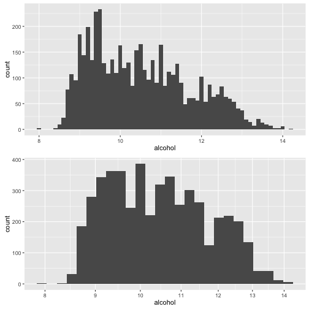

```
##    Min. 1st Qu.  Median    Mean 3rd Qu.    Max. 
##    8.00    9.50   10.40   10.51   11.40   14.20
```

```
##    vars    n  mean   sd median trimmed  mad min  max range skew kurtosis
## X1    1 4898 10.51 1.23   10.4   10.43 1.48   8 14.2   6.2 0.49     -0.7
##      se
## X1 0.02
```

The data on alcohol content seems to be positively skewed, with half of the white wines below 10.4% ABV, but with a long range beyond this to a maximum alcohol content of 14.2%. This behavior is verified with a logarithmic transform on alcohol content also showing a slightly skewed distribution.

### Residual Sugar
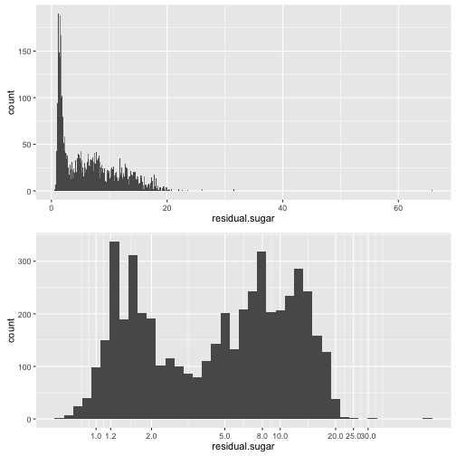

```
##    Min. 1st Qu.  Median    Mean 3rd Qu.    Max. 
##   0.600   1.700   5.200   6.391   9.900  65.800
```

```
##    vars    n mean   sd median trimmed  mad min  max range skew kurtosis
## X1    1 4898 6.39 5.07    5.2     5.8 5.34 0.6 65.8  65.2 1.08     3.46
##      se
## X1 0.07
```

The data for residual sugar has a definite bimodal distribution, with peaks around 1.2 and again around 8. There also appear to be some outliers in the dataset with residual sugar measurements well out of the typical range (>20 g/dm^3). Future analyses of residual sugar data in this report will remove the top 0.1% of these values to provide more meaningful plots and distribution fitting.

### pH
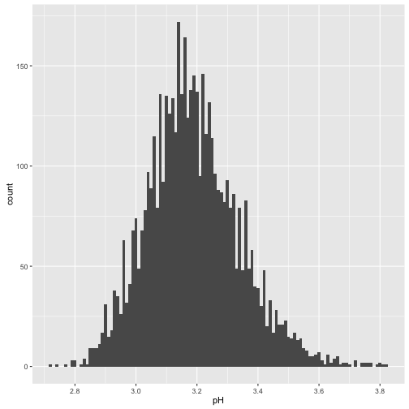

```
##    Min. 1st Qu.  Median    Mean 3rd Qu.    Max. 
##   2.720   3.090   3.180   3.188   3.280   3.820
```

```
##    vars    n mean   sd median trimmed  mad  min  max range skew kurtosis
## X1    1 4898 3.19 0.15   3.18    3.18 0.15 2.72 3.82   1.1 0.46     0.53
##    se
## X1  0
```

The pH data appears to have a normal distribution, with a mean pH level of 3.188 and standard deviation of 0.15. We can approximate that 95% of the data contains a pH level between 2.9 and 3.5.

### Quality
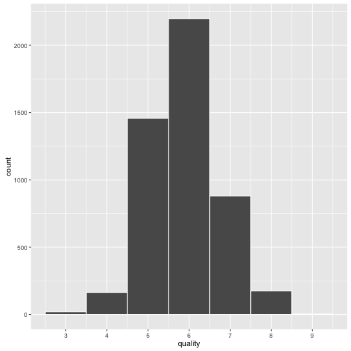

```
##    Min. 1st Qu.  Median    Mean 3rd Qu.    Max. 
##   3.000   5.000   6.000   5.878   6.000   9.000
```

```
##    vars    n mean   sd median trimmed  mad min max range skew kurtosis
## X1    1 4898 5.88 0.89      6    5.85 1.48   3   9     6 0.16     0.21
##      se
## X1 0.01
```

Quality also appears to have a normal distribution with the mean and median quality for the dataset of approximately 6. While the rating scale ranges from 0 (worst) to 10 (best), the range for this dataset is between 3 and 9. Even still, there are very few wines in this set that were given these minimum and maximum ranges, with a vast majority of the wines receiving an average rating between 5 and 7.

### Other Plots
#### Approximately Normal Distributions

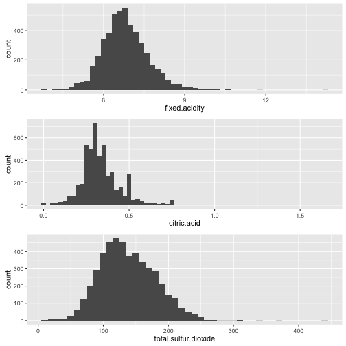

```
##  fixed.acidity     citric.acid     total.sulfur.dioxide
##  Min.   : 3.800   Min.   :0.0000   Min.   :  9.0       
##  1st Qu.: 6.300   1st Qu.:0.2700   1st Qu.:108.0       
##  Median : 6.800   Median :0.3200   Median :134.0       
##  Mean   : 6.855   Mean   :0.3342   Mean   :138.4       
##  3rd Qu.: 7.300   3rd Qu.:0.3900   3rd Qu.:167.0       
##  Max.   :14.200   Max.   :1.6600   Max.   :440.0
```

Fixed acidity, citric acid, and total sulfur dioxide appear to be normally distributed for this dataset. Looking at the minimum values of each, there seems to be a few wines with a citric acid measurement of 0 g/dm^3. To quantify these cases, I calculated a new variable 'citric.acid.zero' 
Citric Acid shows a minimum of 0...is this possible? Looking at the cases in which citric acid is equal to zero:


```
## citric.acid.zero
## FALSE  TRUE 
##  4879    19
```

```
##      residual.sugar   pH alcohol quality
## 116             1.5 3.63     9.7       4
## 301             1.6 3.27    10.8       6
## 303             1.6 3.27    10.8       6
## 781             1.4 3.37    11.2       4
## 863             6.5 3.36     9.9       6
## 865             6.5 3.35     9.9       5
## 891             6.4 3.30     9.9       6
## 1153            1.3 3.31     9.4       4
## 1818            0.8 3.19     9.2       4
## 2322            1.4 3.79    10.2       5
## 2630            1.3 3.56    10.9       5
## 3455            1.4 3.26    12.4       5
## 3572            5.6 3.32    10.5       4
## 3636            1.5 3.29    12.4       6
## 4299           10.2 3.44    12.4       6
## 4598           13.0 3.15    10.7       6
## 4780            0.8 3.10    10.9       4
## 4793            3.4 3.53    13.8       6
## 4878            0.8 3.25     8.8       5
```

And calculating the ratio of citric acid = 0:


```r
sum(citric.acid.zero == 1)/length(citric.acid.zero)
```

```
## [1] 0.003879134
```

Citric acid is used to add "freshness" to wine, according to information from the dataset's source, so it does make sense that wines that do not contain citric acid receive mediocre to average wine ratings (between 4 and 6)

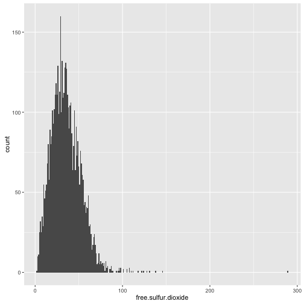

Interestingly, measurements for free sulfur dioxide are somewhat skewed right. To compare free sulfur dioxide with total sulfur dioxide, I created a new variable called "percent.free.sulfur.dioxide", defined as follows:


```r
df$percent.free.sulfur.dioxide = df$free.sulfur.dioxide/df$total.sulfur.dioxide
```
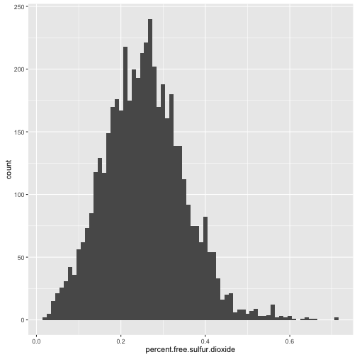

Percent free sulfur dioxide is a normal distribution with a bit of a tail on the right. How free sulfur dioxide is added to the wine to adjust pH levels will be discussed later in this report.

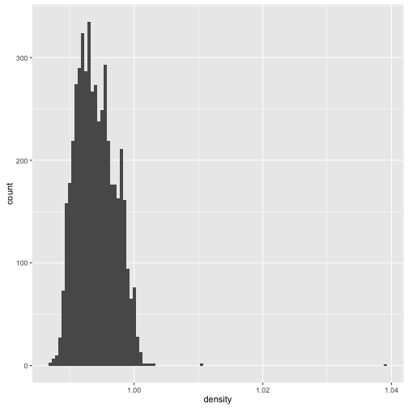

```
##    Min. 1st Qu.  Median    Mean 3rd Qu.    Max. 
##  0.9871  0.9917  0.9937  0.9940  0.9961  1.0390
```

```
##    vars    n mean sd median trimmed mad  min  max range skew kurtosis se
## X1    1 4898 0.99  0   0.99    0.99   0 0.99 1.04  0.05 0.98     9.78  0
```

Density appears skewed to the right due to outliers. To correct this, I removed top 0.1% of data to plot only the 99.9th percentile.

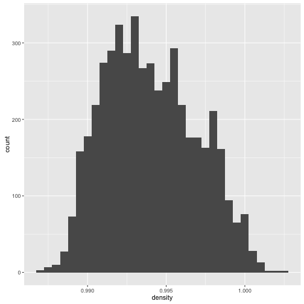

```
##    Min. 1st Qu.  Median    Mean 3rd Qu.    Max. 
##  0.9871  0.9917  0.9937  0.9940  0.9961  1.0020
```

The data still appears slightly skewed to the right, with a median density of 0.9937 and a mean of 0.9940. The range of density is between 0.9871 to 1.002.

#### Skewed Distributions
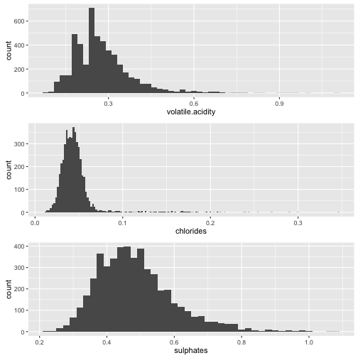

```
##  volatile.acidity   chlorides         sulphates     
##  Min.   :0.0800   Min.   :0.00900   Min.   :0.2200  
##  1st Qu.:0.2100   1st Qu.:0.03600   1st Qu.:0.4100  
##  Median :0.2600   Median :0.04300   Median :0.4700  
##  Mean   :0.2782   Mean   :0.04577   Mean   :0.4898  
##  3rd Qu.:0.3200   3rd Qu.:0.05000   3rd Qu.:0.5500  
##  Max.   :1.1000   Max.   :0.34600   Max.   :1.0800
```

The distributions of volatile acidity, chlorides, and sulphates are positively skewed. It's interesting to note that the chlorides appear to have a normal distribution between 0 and 0.1 g/dm^3, but with such a high count of data points with chlorides above this range, it is difficult to rule these out as outliers in the dataset. 

### Separating Low and High Quality Wines
For this study, I considered low-quality ratings to be <=4 and high-quality >=8
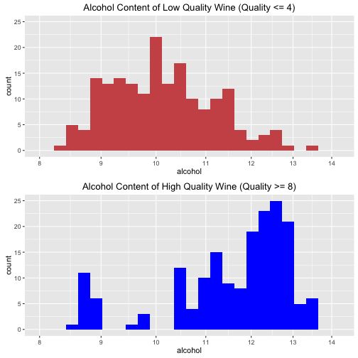

This separation of high and low-quality wine gives some interesting insight into the data. It appears that while the majority of low-quality wines have an alcohol content around 10%, most high-quality wine has an alcohol concentration much higher on the scale (above 12%). Alcohol already appears to have some influence on wine quality ratings, and will be explored as a primary factor later in the report.

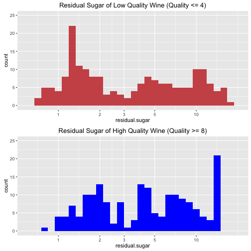

Residual sugar shows a bimodal distribution for both low and high quality wines, which makes sense considering the distribution or residual sugar for all wines was also bimodal. It's unclear how much residual sugar influences wine quality at this point, but it will also be explored more later in this report.

### Alcohol by Quality
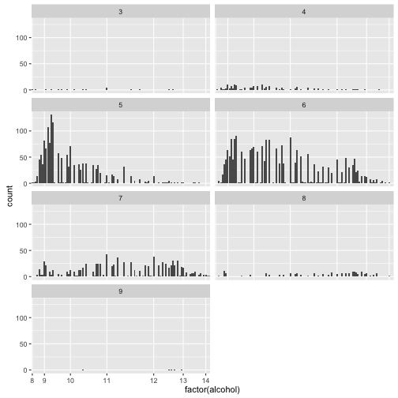

Looking at a facet grid of alcohol grouped by quality rating, quality 4 and 5 appear to have a high count of lower alcohol-content wine, while quality = 8 has a high count in the upper range (above 11%).

# Univariate Analysis

### What is the structure of your dataset?
The dataset contains data for 4,898 wines with 12 features (fixed acidity, volatile acidity, citric acid, residual sugar, chlorides, free sulfur dioxide, total sulfur dioxide, density, pH, sulphates, alcohol, quality). Quality is the only variable in the dataset that could be considered categorical, although it contains integer values.

Quality of the wines range from 3 to 9 (on a scale of 0 to 10 with 10 being the highest possible rating). Most wines fall within the range of 5-7. Alcohol content for most wines are between 8% and 14%, with a median alcohol content of 10.4%. pH ranges from 2.7 to 3.8, with the majority falling in the range of 2.9 to 3.5

### What is/are the main feature(s) of interest in your dataset?
The main features of the dataset are alcohol, residual sugar, pH (acidity), and quality. I would like to determine how these first three features relate to each other and how they affect the quality rating on wine.

### What other features in the dataset do you think will help support your investigation into your feature(s) of interest?
Fixed, citric, and volatile acidity are likely to contribute to the pH level of wine. I am also interested to see how density relates to alcohol content.

I'm also interested in seeing how free sulfur dioxide relates to the pH level, and how this relationship affects wine quality. From some initial research, I've found that there is a recommended level of molecular SO2 for white wines (0.8ppm), which is given as a value dependent on pH as listed at the link here:
http://srjcstaff.santarosa.edu/~jhenderson/SO2.pdf
According to the link, "free SO2 over 50ppm can be tasted and detected in the nose of the wine." To analyze this, I've also created a variable (molecular SO2), which gives the value of free SO2 needed for different pH levels to give the recommended concentration of 0.8 ppm molecular SO2

### Did you create any new variables from existing variables in the dataset?
I created a new variable to calculate the ratio of free sulfur dioxide to total sulfur dioxide. 

### Of the features you investigated, were there any unusual distributions? Did you perform any operations on the data to tidy, adjust, or change the form of the data? If so, why did you do this?
Residual sugar showed a bimodal distribution, so a logarithmic transformation of the x-axis was used to confirm this observation. A similar transformation was used to notice the somewhat bimodal distribution of alcohol, and further investigation by observing only the highest and lowest quality of wines showed highly rated wines tend to contain more alcohol content then very lowly rated wine.

There were some wines that contained exactly 0 g/dm^3 of citric acid, which is used add 'freshness' and flavor to wine. Upon further investigation, I found that because most naturally occurring citric acid from grapes is used during the wine's fermentation process, it is commonly added after fermentation to counteract sweetness and bitterness in the natural wine flavor. It makes sense then that the wines containing no citric acid received poor to mediocre quality ratings (6 or below).
https://www.winefrog.com/definition/243/citric-acid

# Bivariate Plots Section

```
##                      fixed.acidity residual.sugar chlorides
## fixed.acidity                1.000          0.089     0.023
## residual.sugar               0.089          1.000     0.089
## chlorides                    0.023          0.089     1.000
## free.sulfur.dioxide         -0.049          0.299     0.101
## total.sulfur.dioxide         0.091          0.401     0.199
## density                      0.265          0.839     0.257
## pH                          -0.426         -0.194    -0.090
## alcohol                     -0.121         -0.451    -0.360
## quality                     -0.114         -0.098    -0.210
##                      free.sulfur.dioxide total.sulfur.dioxide density
## fixed.acidity                   -0.04940               0.0911   0.265
## residual.sugar                   0.29910               0.4014   0.839
## chlorides                        0.10139               0.1989   0.257
## free.sulfur.dioxide              1.00000               0.6155   0.294
## total.sulfur.dioxide             0.61550               1.0000   0.530
## density                          0.29421               0.5299   1.000
## pH                              -0.00062               0.0023  -0.094
## alcohol                         -0.25010              -0.4489  -0.780
## quality                          0.00816              -0.1747  -0.307
##                            pH alcohol quality
## fixed.acidity        -0.42586   -0.12 -0.1137
## residual.sugar       -0.19413   -0.45 -0.0976
## chlorides            -0.09044   -0.36 -0.2099
## free.sulfur.dioxide  -0.00062   -0.25  0.0082
## total.sulfur.dioxide  0.00232   -0.45 -0.1747
## density              -0.09359   -0.78 -0.3071
## pH                    1.00000    0.12  0.0994
## alcohol               0.12143    1.00  0.4356
## quality               0.09943    0.44  1.0000
```

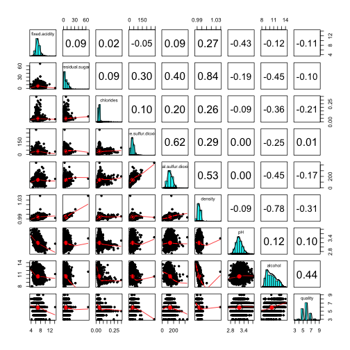

From the subset of data selected for this analysis, it appears that there is a pretty high correlation between the following:

* Residual sugar and wine density (0.84)

* Density and alcohol (-0.78)

* Total sulfur dioxide and free sulfur dioxide (0.62)

I want to look at scatterplots for these three relationships and see if I can fit a linear or polynomial fit to these distributions.

### Scatterplots

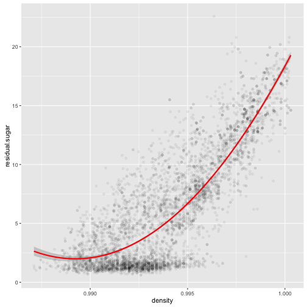

```
## 
## Call:
## lm(formula = residual.sugar ~ poly(density, 2), data = subset(df, 
##     density <= quantile(density, 0.99)))
## 
## Residuals:
##      Min       1Q   Median       3Q      Max 
## -10.6374  -1.5388  -0.3255   1.4528  13.4428 
## 
## Coefficients:
##                    Estimate Std. Error t value Pr(>|t|)    
## (Intercept)         6.25993    0.03559  175.88   <2e-16 ***
## poly(density, 2)1 278.86817    2.47844  112.52   <2e-16 ***
## poly(density, 2)2  83.89487    2.47844   33.85   <2e-16 ***
## ---
## Signif. codes:  0 '***' 0.001 '**' 0.01 '*' 0.05 '.' 0.1 ' ' 1
## 
## Residual standard error: 2.478 on 4846 degrees of freedom
## Multiple R-squared:  0.7402,	Adjusted R-squared:  0.7401 
## F-statistic:  6903 on 2 and 4846 DF,  p-value: < 2.2e-16
```

This Relationship appears to be positive and nonlinear. As density increases, residual sugar also increases at a more and more rapid rate. A 2nd order polynomial regression does a pretty good job at fitting this data, with an R^2 value of 0.74 (a linear fit only produced an R-squared value of 0.67)

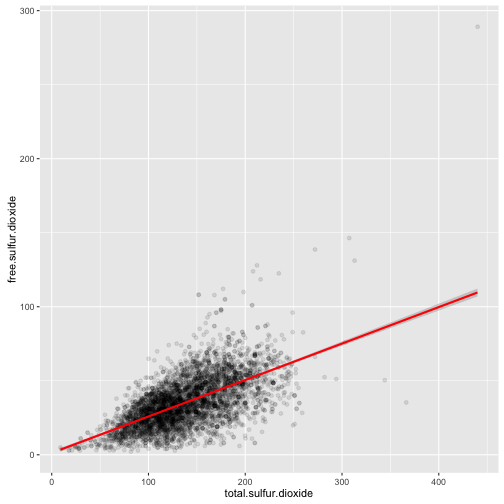

```
## 
## Call:
## lm(formula = free.sulfur.dioxide ~ total.sulfur.dioxide, data = df)
## 
## Residuals:
##     Min      1Q  Median      3Q     Max 
## -56.002  -8.319  -0.269   7.765 179.394 
## 
## Coefficients:
##                      Estimate Std. Error t value Pr(>|t|)    
## (Intercept)          1.227784   0.652422   1.882   0.0599 .  
## total.sulfur.dioxide 0.246315   0.004508  54.645   <2e-16 ***
## ---
## Signif. codes:  0 '***' 0.001 '**' 0.01 '*' 0.05 '.' 0.1 ' ' 1
## 
## Residual standard error: 13.41 on 4896 degrees of freedom
## Multiple R-squared:  0.3788,	Adjusted R-squared:  0.3787 
## F-statistic:  2986 on 1 and 4896 DF,  p-value: < 2.2e-16
```

Relationship is clearly positive, with free sulfur dioxide increasing along with total sulfur dioxide, but does not show good correlation with linear fit. For higher values of SO2, the variation is too high to fit any sort of predictive model to the dataset.

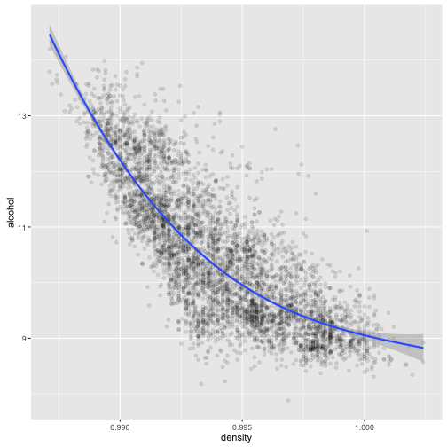

```
## 
## Call:
## lm(formula = alcohol ~ poly(density, 3), data = subset(df, density <= 
##     quantile(df$density, 0.999)))
## 
## Residuals:
##     Min      1Q  Median      3Q     Max 
## -2.5160 -0.4401 -0.0745  0.3994  3.1832 
## 
## Coefficients:
##                     Estimate Std. Error  t value Pr(>|t|)    
## (Intercept)        10.514690   0.009703 1083.651  < 2e-16 ***
## poly(density, 3)1 -69.359189   0.678726 -102.190  < 2e-16 ***
## poly(density, 3)2  18.400787   0.678726   27.111  < 2e-16 ***
## poly(density, 3)3  -2.711456   0.678726   -3.995 6.57e-05 ***
## ---
## Signif. codes:  0 '***' 0.001 '**' 0.01 '*' 0.05 '.' 0.1 ' ' 1
## 
## Residual standard error: 0.6787 on 4889 degrees of freedom
## Multiple R-squared:  0.696,	Adjusted R-squared:  0.6958 
## F-statistic:  3731 on 3 and 4889 DF,  p-value: < 2.2e-16
```

There is a strong relationship between alcohol and density, and it is fit fairly well using a 3rd order polynomial regression (R-squared value of 0.7). A high variation in the data, however, makes it very hard to accurately predict alcohol content based solely on density.

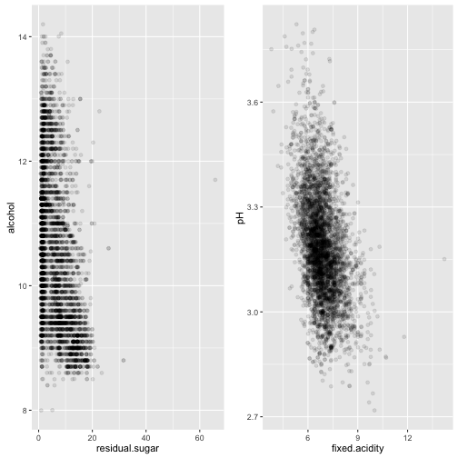

```
## [1] -0.4506312
```

```
## [1] -0.4258583
```

The relationships between residual sugar and alcohol concentration and between fixed acidity and pH are moderately correlated, with correlation values of -0.45 and -0.43, respectively. It appears that pH decreases with increased fixed acidity, as one would expect, but there is a lot of variation in this to accurately predict based off a regression model alone.

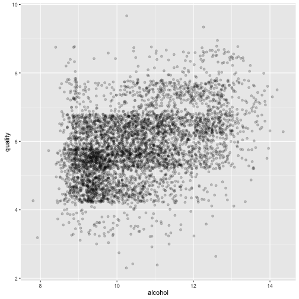

```
## [1] 0.4355747
```

When plotted, there is some apparent positive correlation between alcohol and quality, with higher quality wine typical having a higher alcohol concentration, but it is clearly not the only factor influencing wine quality. Trying to correlate discrete quality measurements (integers) with more continuous data like alcohol content makes it difficult to find a strong linear correlation based on the data alone. This data would lend itself better to clustering by quality rating than by fitting a linear model.

### Boxplots
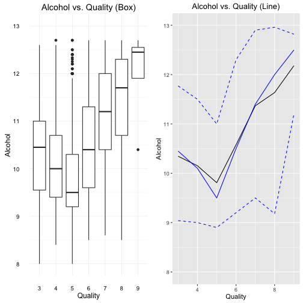

```
## $`3`
##    Min. 1st Qu.  Median    Mean 3rd Qu.    Max. 
##    8.00    9.55   10.45   10.34   11.00   12.60 
## 
## $`4`
##    Min. 1st Qu.  Median    Mean 3rd Qu.    Max. 
##    8.40    9.40   10.10   10.15   10.75   13.50 
## 
## $`5`
##    Min. 1st Qu.  Median    Mean 3rd Qu.    Max. 
##   8.000   9.200   9.500   9.809  10.300  13.600 
## 
## $`6`
##    Min. 1st Qu.  Median    Mean 3rd Qu.    Max. 
##    8.50    9.60   10.50   10.58   11.40   14.00 
## 
## $`7`
##    Min. 1st Qu.  Median    Mean 3rd Qu.    Max. 
##    8.60   10.60   11.40   11.37   12.30   14.20 
## 
## $`8`
##    Min. 1st Qu.  Median    Mean 3rd Qu.    Max. 
##    8.50   11.00   12.00   11.64   12.60   14.00 
## 
## $`9`
##    Min. 1st Qu.  Median    Mean 3rd Qu.    Max. 
##   10.40   12.40   12.50   12.18   12.70   12.90
```

Looking at a boxplot of alcohol vs wine quality, it is apparent that high quality wine tends to have a higher alcohol content than average wines. In this case there is a clear separation between high-quality and average quality, but it would be difficult to separate average and low-quality wines based solely on this criteria.

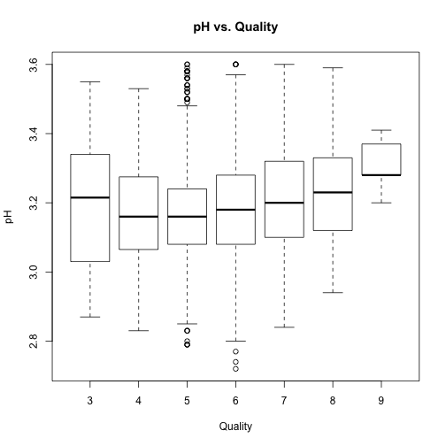

```
## $`3`
##    Min. 1st Qu.  Median    Mean 3rd Qu.    Max. 
##   2.870   3.035   3.215   3.188   3.325   3.550 
## 
## $`4`
##    Min. 1st Qu.  Median    Mean 3rd Qu.    Max. 
##   2.830   3.070   3.160   3.183   3.280   3.720 
## 
## $`5`
##    Min. 1st Qu.  Median    Mean 3rd Qu.    Max. 
##   2.790   3.080   3.160   3.169   3.240   3.790 
## 
## $`6`
##    Min. 1st Qu.  Median    Mean 3rd Qu.    Max. 
##   2.720   3.080   3.180   3.189   3.280   3.810 
## 
## $`7`
##    Min. 1st Qu.  Median    Mean 3rd Qu.    Max. 
##   2.840   3.100   3.200   3.214   3.320   3.820 
## 
## $`8`
##    Min. 1st Qu.  Median    Mean 3rd Qu.    Max. 
##   2.940   3.120   3.230   3.219   3.330   3.590 
## 
## $`9`
##    Min. 1st Qu.  Median    Mean 3rd Qu.    Max. 
##   3.200   3.280   3.280   3.308   3.370   3.410
```

The pH level of wine also has a slight impact on its quality, but does not appear to be significant enough to allow us to predict quality based on pH. There is much less variation in pH for the highest quality rating, but this could also be due to the limited number of samples with this quality score.

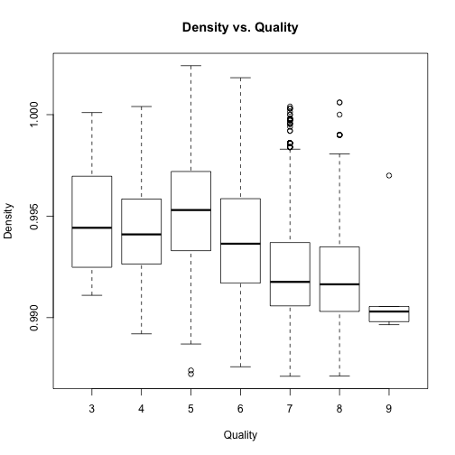

```
## $`3`
##    Min. 1st Qu.  Median    Mean 3rd Qu.    Max. 
##  0.9911  0.9925  0.9944  0.9949  0.9969  1.0000 
## 
## $`4`
##    Min. 1st Qu.  Median    Mean 3rd Qu.    Max. 
##  0.9892  0.9926  0.9941  0.9943  0.9958  1.0000 
## 
## $`5`
##    Min. 1st Qu.  Median    Mean 3rd Qu.    Max. 
##  0.9872  0.9933  0.9953  0.9953  0.9972  1.0020 
## 
## $`6`
##    Min. 1st Qu.  Median    Mean 3rd Qu.    Max. 
##  0.9876  0.9917  0.9937  0.9940  0.9959  1.0390 
## 
## $`7`
##    Min. 1st Qu.  Median    Mean 3rd Qu.    Max. 
##  0.9871  0.9906  0.9918  0.9925  0.9937  1.0000 
## 
## $`8`
##    Min. 1st Qu.  Median    Mean 3rd Qu.    Max. 
##  0.9871  0.9903  0.9916  0.9922  0.9935  1.0010 
## 
## $`9`
##    Min. 1st Qu.  Median    Mean 3rd Qu.    Max. 
##  0.9896  0.9898  0.9903  0.9915  0.9906  0.9970
```

There is a clear correlation betweeen density and quality, with higher quality wines having a lower density measurement. However, this could be either a contributor to the wine quality or, more likely, a result of higher alcohol content found in higher-quality wines.

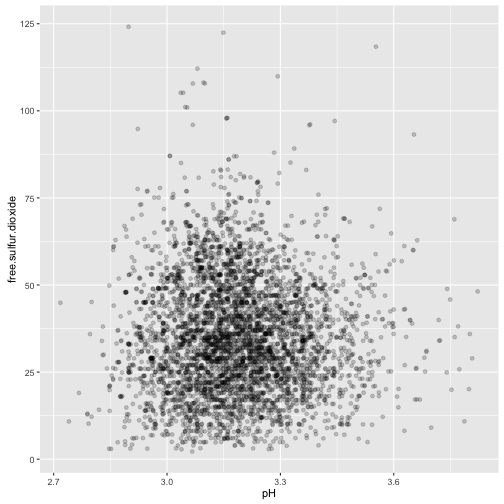

```
## [1] -0.0006177961
```

Finally, looking at how free SO2 relates to pH, there does not seem to be an apparent linear correlation between the two. However this will be explored further by grouping this data by quality in the next plotting section of this report.

# Bivariate Analysis

### Talk about some of the relationships you observed in this part of the investigation. How did the feature(s) of interest vary with other features in the dataset?
Density had a strong correlation with residual sugar, where wines with a higher residual sugar content also tended to have higher density measurements. Density was also highly related to alcohol content as well.

Looking at the other features of interest, quality seemed to be most influenced by alcohol content, but not to a degree that can assume a direct correlation. It appeared that higher quality wines had a higher alcohol content in general than lower quality, but the lowest overall alcohol content was found in average quality ratings. The lowest median ABV of 9.5% was found in wine with a quality of 5, while 3-quality wines had a median ABV of ~10.5%, and a rating of 8 of higher had a median ABV above 12%.

pH was most related to fixed acidity, but did not seem to have any meaningful relationship with alcohol content, quality, or residual sugar.


### Did you observe any interesting relationships between the other features (not the main feature(s) of interest)?
There were a couple of unexpected but nonetheless meaningful correlations observed in the dataset. Some correlation was observed between pH and fixed acidity, although not as strong as one might expect. Additionally, citric acid and volatile acidity had little to no effect on wine pH level.
One strong, and also relatively less surprising correlation was found between total SO2 and free SO2.

### What was the strongest relationship you found?
The strongest correlation in the dataset is a positive one between density and residual sugar. There was also a very strong negative correlation between density and alcohol content. However, this did not imply an equally strong relation between alcohol content and residual sugar, although some correlation was observed between these two factors.


# Multivariate Plots Section

The first thing I was interested in revisiting for this section was analyzing the level of molecular SO2 for each wine. For white wine, the recommended molecular SO2 is 0.8ppm, which corresponds to the following relationship of free SO2 to pH:


```
## 
## 2.9   3 3.1 3.2 3.3 3.4 3.5 3.6 3.7 3.8 3.9   4 
##  11  13  16  20  26  32  40  50  63  81  99 125
```

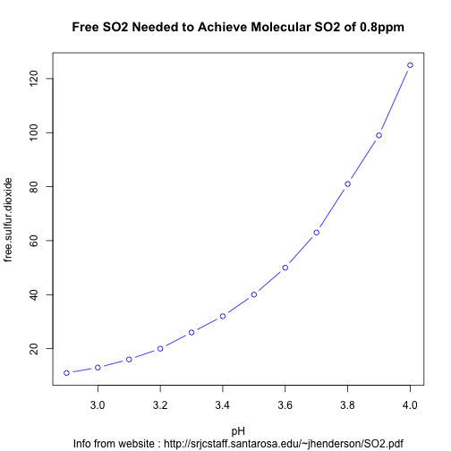

I added these to a new data frame called 'optim_wine' (containing "optimal" free SO2 for each pH level), and calculated a 3rd order polynomial regression model for it:


```r
optim_wine = data.frame(pH, free.sulfur.dioxide)
model <- lm(optim_wine$free.sulfur.dioxide ~ poly(optim_wine$pH, 3))
```
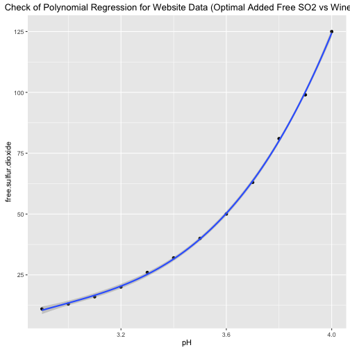

```
## 
## Call:
## lm(formula = optim_wine$free.sulfur.dioxide ~ poly(optim_wine$pH, 
##     3))
## 
## Residuals:
##      Min       1Q   Median       3Q      Max 
## -1.21678 -0.48019 -0.01865  0.55769  0.90210 
## 
## Coefficients:
##                         Estimate Std. Error t value Pr(>|t|)    
## (Intercept)              48.0000     0.2284 210.179 2.94e-16 ***
## poly(optim_wine$pH, 3)1 116.1540     0.7911 146.822 5.18e-15 ***
## poly(optim_wine$pH, 3)2  38.7046     0.7911  48.924 3.37e-11 ***
## poly(optim_wine$pH, 3)3   7.6934     0.7911   9.725 1.05e-05 ***
## ---
## Signif. codes:  0 '***' 0.001 '**' 0.01 '*' 0.05 '.' 0.1 ' ' 1
## 
## Residual standard error: 0.7911 on 8 degrees of freedom
## Multiple R-squared:  0.9997,	Adjusted R-squared:  0.9995 
## F-statistic:  8015 on 3 and 8 DF,  p-value: 3.011e-14
```

Additionally, I modified the main data frame to include two quality variables:

* quality     - converted to a factor

* quality_int - original integer quality variable


```r
df$quality_int <- df$quality
df$quality <- as.factor(df$quality)
```


Plotting this data of free SO2 vs pH, categorized by quality, and overlayed by the "optimum" free SO2 level, gives the following:

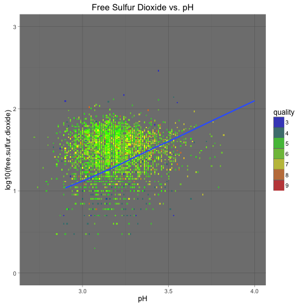

It's difficult to see the relationship with all qualities on a single plot, although there are some clear points showing the lowest quality wines a great distance from the optimal line. I created 3 plots split by high, medium, and low quality wines.

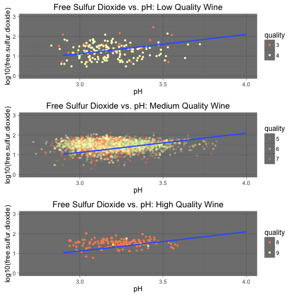

Looking at the three plots, there is a clear difference between the high and low quality wines. The free SO2 measurements for the low-quality wines seem to be scattered in an unpredictable way around the optimal curve, while these measurements for high-quality wine appear much more concentrated around this line. This is a good indication that having the correct relationship of free SO2 to pH may be an important factor influencing wine quality, especially for higher pH measurements. However, more data is needed for higher and lower quality wines to confirm this interpretation of the data

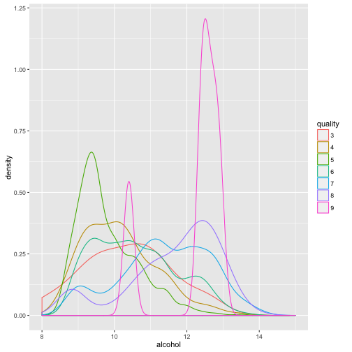

Looking at a density plot of alcohol, colored by quality rating, we again see a clear difference in alcohol concentration between higher and lower quality wines. For the high quality wine, it appears that a majority of them have an alcohol content above 12%, while most of the lower quality wines are below 12%

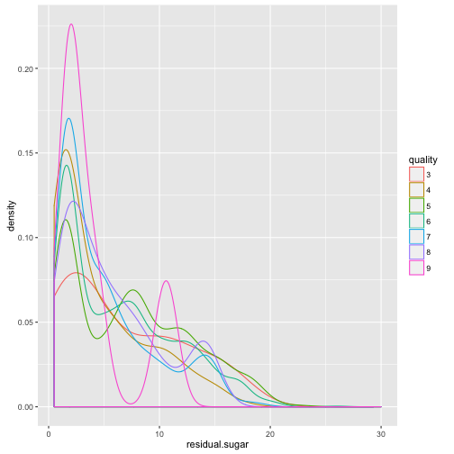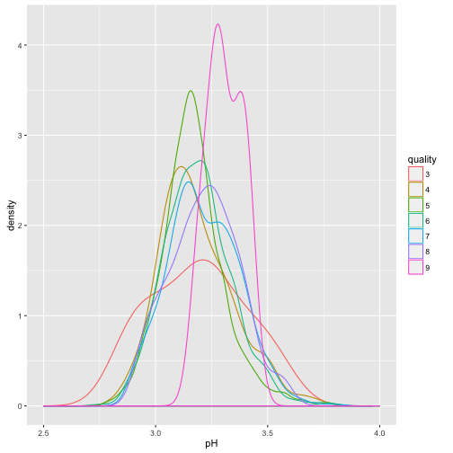

Residual sugar and pH prove to be less reliable ways of grouping by wine quality, although pH does tend to be slightly higher for higher quality wines, and falls within a much tighter range.

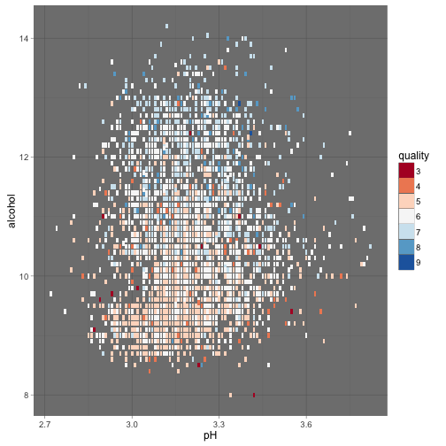

This tile plot helps confirm our assumption that quality is strongly correlated to alcohol content, and only slightly related to pH. While there is no linear relationship for this data, it does suggest that clustering could be a good way of separating high and low quality wines on a plot of pH vs alcohol content.

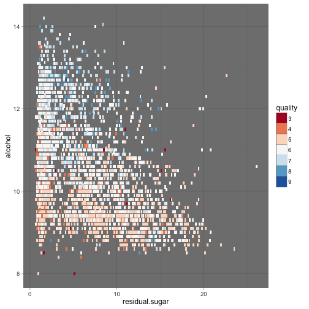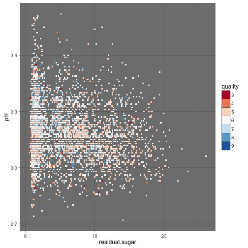

These two tile plots again confirm our previous observations that while alcohol seems to influence wine quality, it is difficult to correlate residual sugar with either alcohol or pH.

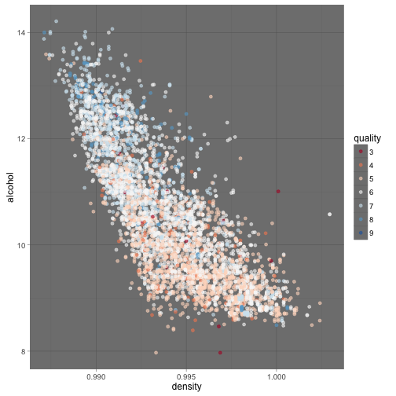

Our last plot confirms a couple of final points. First, there is a clear relationship between alcohol and density, as we first observed in the Bivariate Plotting section of this report. Also, there is a pretty clear separation between high and low quality wine in the chart, with highly rated wine tending to have higher alcohol content and lower wine density.

# Multivariate Analysis

### Talk about some of the relationships you observed in this part of the investigation. Were there features that strengthened each other in terms of looking at your feature(s) of interest?

It was very clear that alcohol concentration has a significant influence on wine quality. This has been a recurring observation throughout this report.

Additionally, a good correlation between alcohol and density was observed during multivariate analysis, although density seems to be a result of alcohol concentration more than a contributing factor to influencing wine quality.

We observed that while these plots grouped by wine quality do not provide a great linear relationship for predictive modeling, there were clear regions on plots of alcohol vs. pH and alcohol vs. density that may provide a good way of predicting wine quality based on this data.

### Were there any interesting or surprising interactions between features?

I was interested to find that there does seem to be an optimal relationship of free SO2 to pH that, while doesn't necessary guarantee a high wine quality, is important to protect wine from oxidation and spoilage. It is also almost necessary to have this ratio correct to achieve a high-quality wine.

------

# Final Plots and Summary

### Plot One

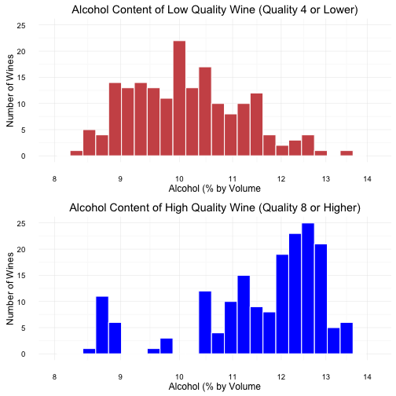

### Description One
While the majority of low-quality wines have an alcohol content between 9% and 11%, most high-quality wine has an alcohol concentration above 11%. There is also somewhat of a gap for high quality wine between 9% and 10%, with only a few samples falling within this range.

### Plot Two

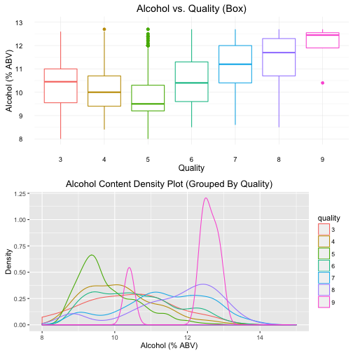

### Description Two
While there is a clear separation in alcohol content between high-quality and average-quality wine, it is difficult to discern average and low-quality wines based solely on their alcohol content. Nevertheless, the majority of high quality wine has a median alcohol content above 11%, but the range for all wines is between 8.5% and 13.5%.

### Plot Three

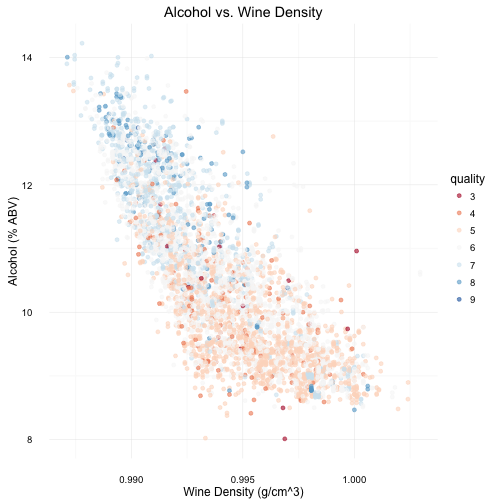

### Description Three
There is definitely a relationship between Alcohol and Wine Density. However, although this relationship is not enough on its own to create a linear or quadratic predictive model of wine quality, there are clear regions on the plot for low and high quality wine. Wine quality could be predicted by applying machine learning techniques to appropriately group data based on alcohol content and density.

------

# Reflection
I started this exploration of data by looking at each individual variable in the data set for 4,898 wines. I then proposed the problem of determining which factors have the most influence on wine quality. Based on my study on individual variables, I selected the three key factors of pH, residual sugar, and alcohol to be the primary basis of solving this problem, while paying attention still to the other variables as secondary factors. I also conducted some independent research to see what role other chemicals (such as Free SO2 and Citric Acid) play in the winemaking process, and chose to study these further as well.

There was clearly a relationship from the beginning between alcohol content and wine quality, although it took a few methods of analysis to discover the extent of this correlation. Because quality was given as integer ratings, it was difficult to determine how strong the relationship was based solely on the calculated correlation coefficient (which was only 0.44), and bivariate analysis of alcohol vs. quality was not enough to identify a clear relationship. However, after applying multivariate analysis on alcohol, quality, and other variables (especially pH), it was apparent that although we could not find a linear relationship, there was a clearly defined separation in alcohol content for high quality wine vs. the rest of the dataset.

Although I did not define a predictive model in this project, I believe there is a good opportunity to apply Machine Learning techniques to clearly define the factors that separate the highest quality wines from the rest. To do this, I would first recommend applying a supervised learning algorithm using classification to define a separation between this regions. It would also be useful to have a larger or separate dataset which contains more high-quality wine ratings to determine the validity of this predictive model, as well as applying the model to red wine data to see if it follows a similar relationship.

# References

What Is Citric Acid?        - https://www.winefrog.com/definition/243/citric-acid

Acidity in Wine and Grapes  - http://www.calwineries.com/learn/wine-chemistry/acidity

Calculating Molecular SO2   - http://srjcstaff.santarosa.edu/~jhenderson/SO2.pdf

Winemaking Calculators      - https://www.winebusiness.com/tools/?go=winemaking.calc&cid=60
